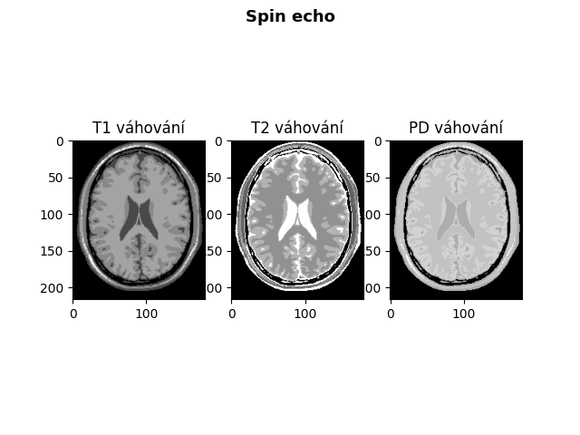

# Basics of Contrast in MRI (Magnetic Resonance Imaging)

## Exercise Description

This project focuses on basic contrast techniques in Magnetic Resonance Imaging (MRI), specifically on modeling three fundamental sequences used to create contrast images depending on various parameters:

- **Spin Echo (SE)**: This sequence type is used for weighting based on T1, T2, and Proton Density (PD).
  
- **Gradient Echo (GE)**: This sequence type utilizes different flip angles (FA) and time parameters (TE) to influence contrast.
  
- **Inversion Recovery (IR)**: This sequence type is used for specific imaging (e.g., suppression of water, gray and white matter) using TR and TI parameters.

In this project, mathematical models of these sequences have been implemented, which are then used to generate sample images demonstrating the effect of different parameters on MRI images.

## Code Description

### Functions for Signal Calculation Based on Parameters

- **S_SE(TR, TE)**: This function calculates the signal for the Spin Echo (SE) sequence, where TR is the repetition time, TE is the echo time, and Rhoa, T1a, T2a are tissue-related parameters.

- **S_GE(TR, TE, FA)**: This function calculates the signal for the Gradient Echo (GE) sequence, which depends on TR, TE, and the flip angle (FA).

- **S_IR(TR, TE, TI)**: This function calculates the signal for the Inversion Recovery (IR) sequence, where TR, TE, and TI (inversion time) influence the contrast displayed.

## Visualization and Sample Images

The generated images include:

- Spin Echo (SE) for various weightings (T1, T2, PD):
  
- Gradient Echo (GE) for various flip angles and TE times.
  
- Inversion Recovery (IR) for various inversion times (TI) that suppress different tissue types.
  
